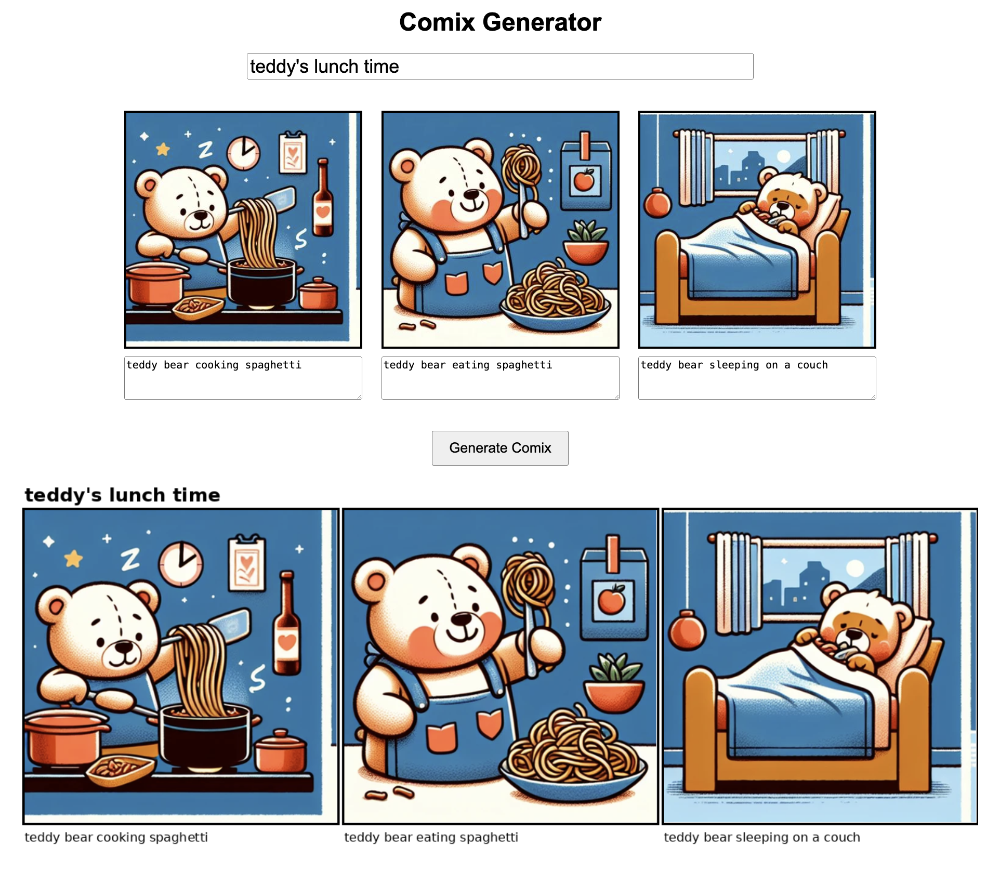

# Comic strip generator

Single-page web application with Flask backend.

Uses DALL-E (v2 and v3), and GPT-4.

Generating three images that should compose a coherent whole poses a problem with DALL-E: It cannot be done, because DALL-E doesn't itself keep context, and the context that can be artificially created using GPT Vision is very rudimentary. Not to worry. We could probably create a three-panel strip with a smaller resolution, but what's the fun in that? Instead, we create four panels arranged in the native square aspect ratio, at the highest resolution, and chop the image, and rearrange the sub-images. This way, we can get 50% higher resolution! (The fourth panel is generated with a synthetic prompt, and promptly discarded.)

Sometimes the pictures do not quite match the prompts -- I'm planning to use GPT Vision to add a reflection step, and re-generate when appropriate. Keep changing the prompts until you are happy with the result.

You can [try it here](https://comix-generator.rdancer.org) if you want.

